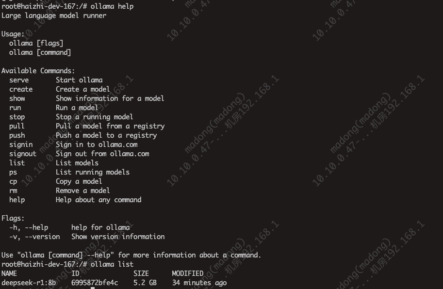

# Ollama安装及私有化部署DeepSeek

## linux安装
```shell
## 一键自动安装
curl -fsSL https://ollama.com/install.sh | sh
## 手动安装下载安装包，然后放到服务器上
zstd -d ollama-linux-amd64.tar.zst  # 先解压.zst
sudo tar xf ollama-linux-amd64.tar -C /usr # 再解.tar
```
启动`ollama`并验证是否正常启动
```shell
ollama serve  ## 启动ollama服务，启动报错：version `GLIBC_2.27' not found
ollama -v ## 验证ollama服务版本
```
## docker安装
```shell
docker pull ollama/ollama:latest
# 启动ollma服务，docker容器共用宿主机网络
docker run -d -v ollama:/root/.ollama -p 11434:11434 --network host --name ollama ollama/ollama
# 在容器中运行，deepseek-r1:8b，拉取模型后，就会弹出对话框
ollama run deepseek-r1:8b
```
`Ollama`的常用指令如下图所示，与`Docker`的用法很类似：
<div>
    
</div>

## Ollama的模型库
`Ollama`支持在`ollama.com/library`上提供的一系列模型。地址：https://ollama.com/library

以下是一些可以下载的示例模型，`DeepSeek R1`的小参数模型：

| 模型 | 参数   | 大小 | 下载命令                        |
|----|------|----|-----------------------------|
| deepseek-r1 | 7b   |  4.7GB  | ollama run deepseek-r1:7b   |
| deepseek-r1   | 8b   | 5.2GB   | ollama run deepseek-r1:8b   |
| deepseek-r1   | 1.5b |  1.1GB  | ollama run deepseek-r1:1.5b |

## 模型问答
```shell
# 如果是多行输入的话，可以用"""xxx"""引起来要提问的内容
>>> 介绍下北京
# Thinking...（大模型思考的过程）
#嗯，用户想了解北京。北京作为中国的首都，确实是个非常值得深入了解的城市。首先，我得确定用户的需求是什么。可能用户只是想快速了解北京的基本情况，或者准备去旅游，或者需要写作业？但考
# 虑到没有更多背景信息
好的，没问题！北京，简称“京”，是中国的首都，是**中华人民共和国的中心**，也是世界上最大、最具影响力的城市之一。它是一座拥有悠久历史和灿烂文化，同时又充满现代活力的超级大都市。。。等
```
## REST API
`Ollama`提供了`REST API`来管理和运行模型，详细内容可参考：https://github.com/ollama/ollama/blob/main/docs/api.md

#### 生成响应
```shell
curl http://localhost:11434/api/generate -d '{
  "model": "deepseek-r1:8b",
  "prompt":"为什么天空是蓝色的？"
}'
```
#### 与模型对话
```shell
curl http://localhost:11434/api/chat -d '{
  "model": "deepseek-r1:8b",
  "messages": [
    { "role": "user", "content": "为什么天空是蓝色的？" }
  ]
}'
```


