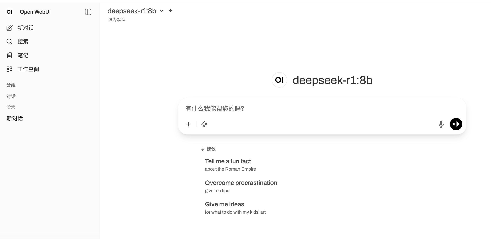

# Open WebUI安装
> `Open WebUI`使用文档: https://docs.openwebui.com/

## docker安装Open WebUI
```shell
# 从镜像中心拉取open-webui镜像
docker pull ghcr.io/open-webui/open-webui:main
# docker run启动open webui服务，目前ollama和open webui部署在同一台机器上
docker run -d -p 3000:8080 --add-host=host.docker.internal:host-gateway \
  -v open-webui:/app/backend/data \
  --name open-webui \
  --restart always \
  ghcr.io/open-webui/open-webui:main
```
## 页面访问
`Open WebUI`访问地址 http://localhost:3000/, 当`Ollama`中部署有多个模型时，可在左上角切换模型名称。
<div>
    
</div>