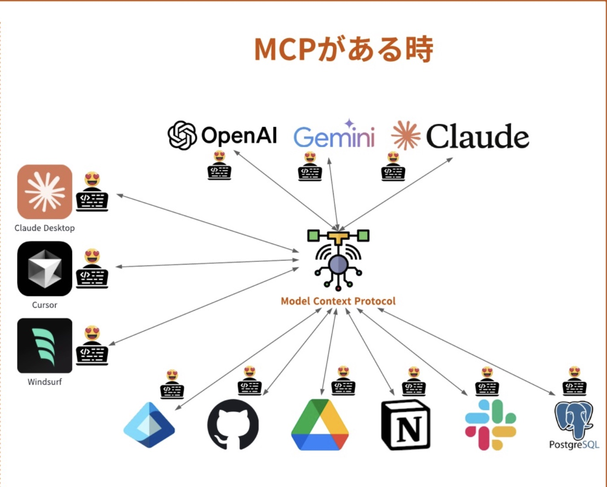
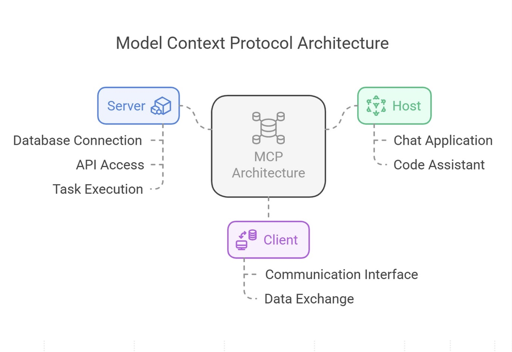
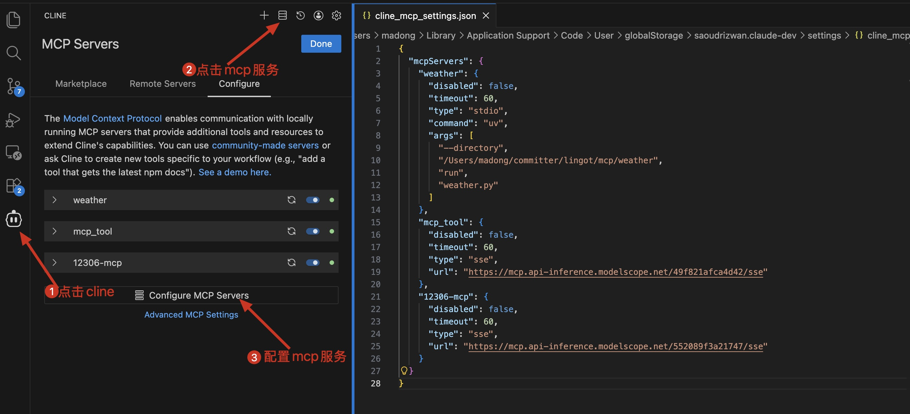
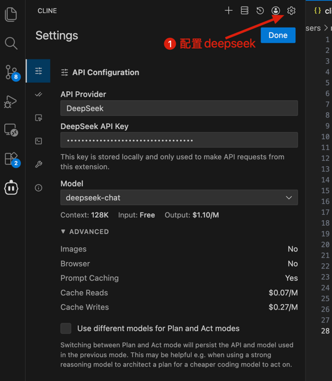
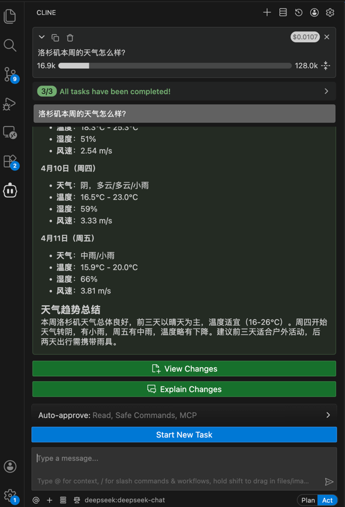

# `MCP`模型上下文协议
> `mcp`设计思路，通用开放的AI协议，相当于在`LLM`和`Agent`之间加了一层，用于统一标准。

## `MCP`的作用
构建"原子`agent`"的基石、标准化与互操作性、单体`agent`任务的实现，可以构建`Agent`和复杂工作流，实现数据和工具整合。

    

我的理解，`mcp`相当于多加的`1`层，`mcp`实现与各种大模型、各种`agents`适配，开发着只需要与`mcp`对接就行，将冗余、繁杂的对接逻辑放在`mcp`中间层。

    

## `Prompts`、`Resources`和`Tools`
- `Prompts`: 设定了任务的框架和高质量的提问方式，给大模型输入提示词；
- `Resources`: 提供个性化的、静态的决策依据，由⽤户主动选择，将精准、可信的上下⽂喂给模型。
- `Tools`: 模型理解了模板和偏好后，开始`orchestrate`(编排)⼀系列⼯具调⽤："天气查询`tool`"、"机票查询`tool`"等。

## `modelscope`社区`mcp`工具
- 国内天气`mcp`：https://modelscope.cn/mcp/servers/@MrCare/mcp_tool
- `12306_mcp`工具：https://modelscope.cn/mcp/servers/@Joooook/12306-mcp

本地新建一个`mcp`天气查询的服务 [weather.py](./weather/weather.py) ，`mcp`工具使用`@mcp.tool()`来装饰，然后在`vscode`中安装`Cline`插件调用`MCP`服务。

    

在`vscode`的配置中，可配置本地的`mcp`服务，也可配置远程例如`modelscope`生成的mcp链接。在`cline`中配置好`mcp`服务后，可以在`config`中配置要使用的大模型，如下方的`deepseek`。

    

使用`cline`在前台通过`mcp`查询，问题"洛杉矶本周的天气怎么样？"，可以看到在对话框下方有`2`种模式，分别为"`Plan`"和"`Act`"，当提问问题时，"Plan"会分析出执行此任务的计划，"Act"则会调用`mcp`执行实际的查询。

    

