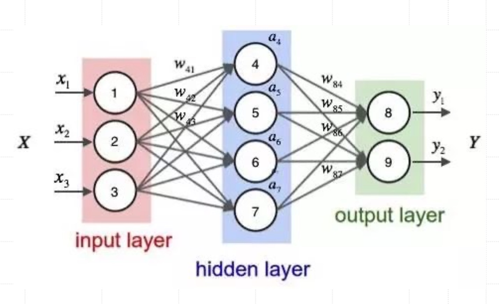

# 机器学习与深度学习基础
> `AI`历史上的四次大发展，`1950`-`1980`人工智能时代，`1980`-`2010`机器学习时代，`2010`-`2020`深度学习时代，`2020`至今为大语言模型时代，人工智能的三大核心：数据、算力和算法。

## 机器学习基础分类

1. 监督学习，会从输入数据和标签对中学习一个映射函数，使得给定输入时，能够预测出正确的输出标签。常见算法有：线性回归、逻辑回归、朴素贝叶斯等，实际应用场景有：垃圾邮箱检测、车牌号识别、情感分析/评论打分等。
 - 训练数据集：输入数据和对应标签。
 - 目标： 学习一个映射函数，将输入映射到正确的输出（标签）。
 - 应用：分类、回归等任务，例如，垃圾邮件分类、房价预测。
2. 半监督学习，常见的算法有：标签传播、高斯混合模型、半监督支持向量机，比较适合标注成本高昂或标注过程耗时的领域，比如：图像分类、社交网络分析、文本分类。
 - 训练数据集：大量没有标签的数据和少量有标签的数据。
 - 目标： 利用少量标签数据来帮助从大量未标注数据中学习，从而提高模型的准确性。
 - 应用：大规模数据集的分类任务，在标注成本高的情况下有很大的应用价值，例如：语音识别、图像分类。
3. 非监督学习，不依赖于标注数据，训练数据没有标签，常见的算法有：`K-means`聚类算法、层次聚类，实际引用场景有：图像压缩、客户分群（点赞、评论、分享划分）、主题建模（自动聚合新闻文章的主题），用于舆情分析和事件追踪。
- 训练数据集：只有输入数据，没有标签信息。
 - 目标： 从数据中找到隐藏的结构或模式，例如通过聚类或降维来分析数据。
 - 应用：聚类、降维、异常检测等任务，例如顾客分群。

## 神经网络与深度学习基础
`1957`年受`Warren`和`Walter`在神经元建模方面工作的启发，心理学家`Frank Rosenblatt`参考大脑中神经元信心传递信号的工作机制，发明了神经感知机模型`Perceptron`。

### 神经元与激活函数
为了实现神经网络的非线性建模能力，解决一些线形不可分的问题，通常使用激活函数来引入非线形因素，常用的有`Sigmoid`、`tanh`、`ReLU`等。激活函数很重要，能增加"智商"，其加入"非线性"，让网络能处理更难的问题。也可做决定，决定这个神经元最终输出什么信号。

### 神经网络中的基础概念
层(`layer`)：基本计算单元，对输入数据进行特定转换，学习方式：调整"连接强度"(模型权重`W`)，让预测结果（输出`Y`）不断接近正确答案（标签`Y`）。
- 输入层，原材料入口，接收原始数据；
- 隐藏层，加工车间，进行信息处理和学习，可以有很多层；
- 输出层，成品出口，产生最终结果；
- 全连接，上一层中的每个神经元都跟下一层的每个神经元连接；深度(`depth`)：指隐藏层的数量，宽度(`width`)：指每层神经元的数量。 

    

学习方法常分为：反向传播和前向传播、反向传播(`Backpropagation`)：
- 反向传播：会先算算错了多少，计算预测结果与正确答案的"误差" (`Loss`)，然后，从后往前追责，倒推每一层的每个连接对误差的"贡献"。告诉大家怎么改，根据"贡献"调整权重，让下次误差变小。
- 前向传播：数据逐层加工，直到输出层产生结果，数据从前往后单向流动（输入层->隐藏层->输出层），不倒流、不绕圈。

### 深度神经网络架构解析
深度学习，更"深"的神经网络（很多隐藏层），层次多的好处有什么？
- 学得更"透彻"（层次化特征）：模仿认知过程，从简单特征到负责特征逐层学习。
- 更"省料"：表达复杂关系时，深网络比浅宽网络更节省参数，浅层学到的通用知识可被深层重用。

深度学习框架，提供了一套用于构建、训练和部署深度学习模型的软件库和工具。"深度学习时代"主流的框架有：`TensorFlow`、`Keras`、`PyTorch`。